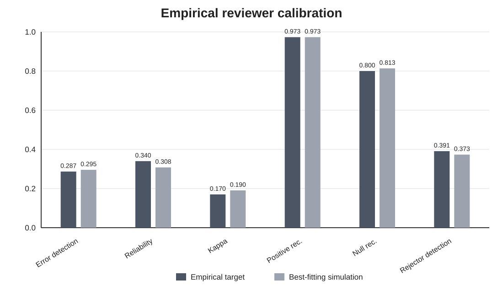
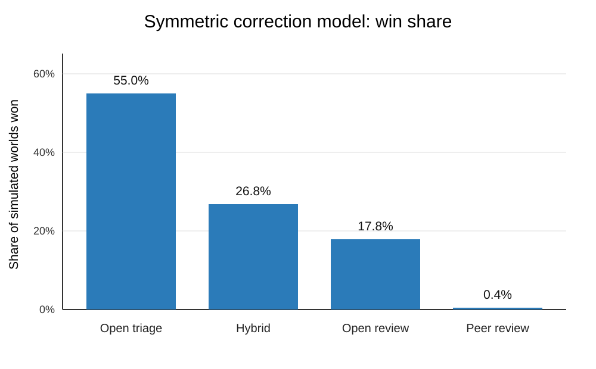
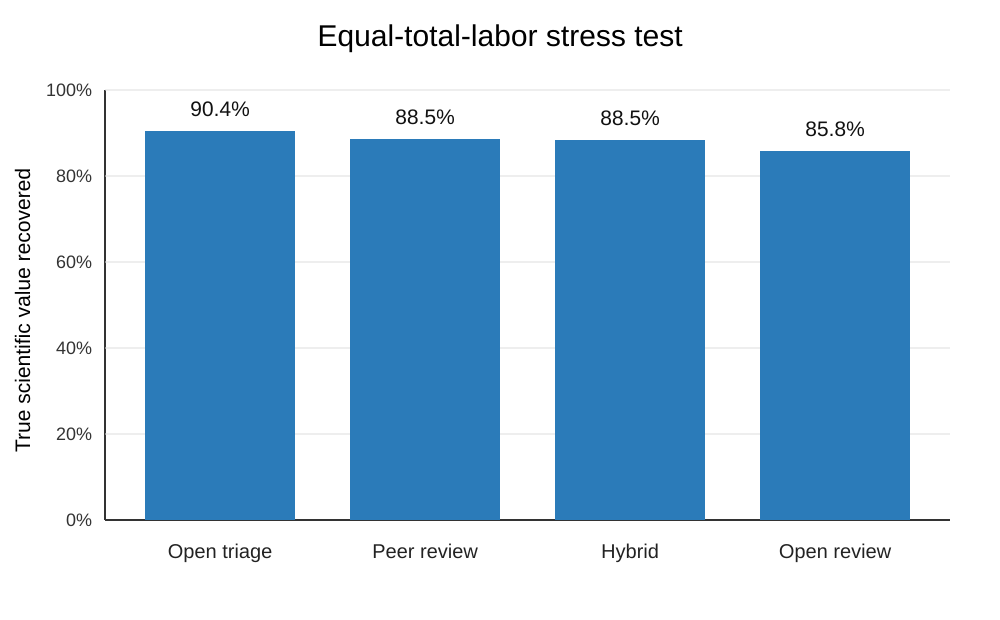
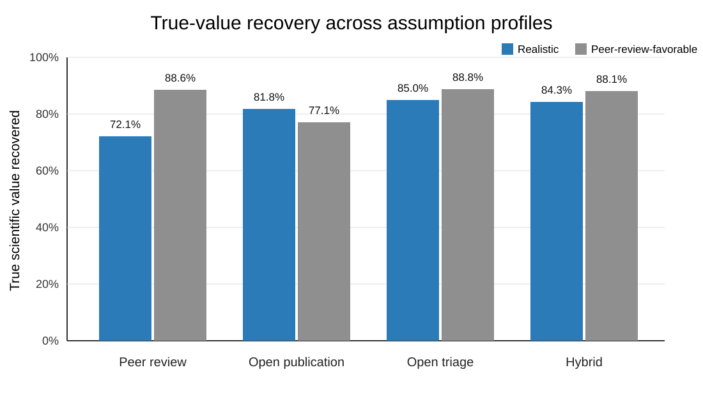
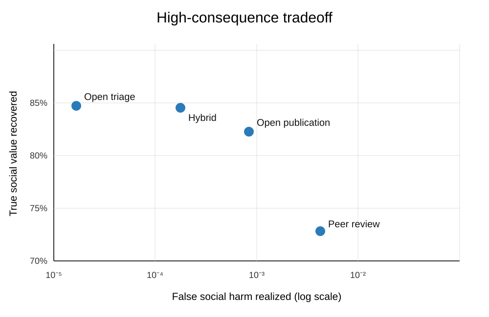

# Peer Review Ecosystem Simulation

This repository contains an agent-based simulation study comparing four scientific publication systems:

1. traditional prepublication peer review;
2. immediate open review;
3. open publication with transparent triage and randomized exploration; and
4. a hybrid model combining immediate public release with optional formal review.

The simulator creates paper populations with hidden false, partially true, and substantially true claims. Simulated agents do not know the hidden state. They observe noisy evidence over time, allocate finite attention, attempt replications, revise manuscripts, detect or miss defects, and update confidence.

## Main paper

- **[Read the paper (PDF)](paper/peer_review_ecosystem_simulation_full.pdf)**
- [Full standalone LaTeX source](paper/peer_review_ecosystem_simulation_full.tex)

The complete manuscript is contained in one LaTeX file with no section-file dependencies. The compiled manuscript, figures, simulation code, calibration targets, and results are included so the study can be read, reproduced, and audited directly from the repository.

## Source code

- `src/scientific_publication_simulator.py`: canonical dynamic publication-ecosystem model.
- `src/symmetric_scientific_review_simulator.py`: symmetric model in which every system can detect defects, repair methods and reporting, miss errors, introduce harmful revisions, and consume expert labor.
- `src/reproduce_robustness_experiments.py`: exact runner for the symmetric-correction and equal-total-labor headline tests.
- `src/calibrate_empirical_model.py`: simulation-based calibration of latent reviewer parameters to controlled-study observables.
- `src/run_calibrated_ecosystem.py`: propagates the committed reviewer calibration through the full publication ecosystem.
- `src/plot_results.R`: regenerates the structural and robustness figures.
- `src/plot_calibrated_results.R`: regenerates the calibration-propagated ecosystem figures.
- `src/legacy_baseline_simulation.py`: earlier known-truth baseline retained for provenance.
- `data/empirical_targets.json`: machine-readable empirical targets, tolerances, epistemic status, and source metadata.
- `ASSUMPTIONS.md`: separates empirically estimated, bounded, partially constrained, illustrative, and normative quantities.

## Installation

```bash
python -m venv .venv
source .venv/bin/activate  # Windows: .venv\Scripts\activate
pip install -r requirements.txt
```

## Run the canonical simulator

```bash
python src/scientific_publication_simulator.py \
  --worlds 5000 \
  --papers 300 \
  --periods 30 \
  --output-dir simulation_output
```

## Run the symmetric simulator

```bash
python src/symmetric_scientific_review_simulator.py \
  --worlds 2000 \
  --papers 300 \
  --periods 30 \
  --output-dir symmetric_output
```

## Reproduce the final robustness results

```bash
python src/reproduce_robustness_experiments.py \
  --output-root reproduced_results
```

This command regenerates the committed symmetric and equal-total-labor summary tables with the reported fixed seed. Use `--world-level` to retain the larger per-world tables.

## Calibrate reviewer behavior to controlled studies

The calibration does not set a latent coefficient equal to an observed percentage. It searches internal parameter space for combinations that reproduce planted-error detection, reviewer reliability, Cohen's kappa, positive-outcome recommendation bias, and rejection-conditioned error detection.

```bash
python src/calibrate_empirical_model.py
```

Outputs are written to `results/empirical_calibration/`:

- `calibration_summary.csv`: empirical targets versus best-fitting and retained-set simulations;
- `accepted_parameters.csv`: retained simulation-consistent parameter combinations;
- `best_fit_parameters.json`: best-fitting latent parameter set;
- `calibration_metadata.json`: run size, seed, method, and interpretive boundary.

The committed fit uses 10,000 parameter evaluations and 5,000 simulated calibration manuscripts. Every primary and secondary observable is within its declared tolerance. This calibrates the reviewer-behavior submodel only. Post-rejection attention loss, abandonment, resubmission, long-run discoverability, open-triage effectiveness, and social-value weights remain partially identified or normative.

A quick structural check is available with:

```bash
make calibrate-quick
```

## Run the calibration-propagated ecosystem

```bash
make calibrated-ecosystem
```

The committed result uses 500 worlds, 250 papers per world, and 25 periods, totaling 125,000 unique simulated papers. Reviewer error detection, disagreement, recommendation behavior, and positive-outcome bias are propagated from the empirical calibration. Post-rejection attention, resubmission, defect prevalence, evidence dynamics, and utility weights remain structural sweeps.

## Recreate the figures in R

The plotting workflow uses base R only and requires no additional R packages:

```bash
make figures
```

The scripts write PNG and SVG files to `paper/figures/` for repository visualization and independent figure regeneration. The standalone LaTeX manuscript contains its publication figures directly.

## Key result figures

### Calibration-propagated ecosystem win shares


### Calibration-propagated truth recovery


### Empirical reviewer calibration



### Symmetric correction model



### Equal-total-labor stress test



### Structural assumption profiles before reviewer calibration



### High-consequence tradeoff



## Included result summaries

The `results/` directory contains compact CSV summaries from dynamic hidden-truth, realistic-versus-idealized, high-consequence and equity-sensitive, peer-review-favorable, symmetric, equal-total-labor, empirical reviewer-calibration, and calibration-propagated ecosystem runs.

Large world-level outputs are intentionally omitted. They can be regenerated with the fixed seeds and commands documented in the source and manuscript.

## Claim being tested

In this repository, **peer review** means the modern institution of mandatory prepublication gatekeeping, not evaluation by knowledgeable peers in general. Every serious comparison retains expert criticism, error detection, revision, replication, and continuing evaluation. The disputed mechanism is the publication veto.

The claim that peer review **always harms science** is meant in a game-theoretic, system-level sense: relative to an otherwise equivalent evaluation system without veto power, adding the gate changes incentives, access, and attention toward a worse scientific equilibrium. It does not mean that every review report is harmful, and it does not challenge expert evaluation itself. The simulations provide strong evidence for this mechanism across the tested parameter families. They are not yet a mathematical dominance proof over every possible institutional design.

## Interpretation

These simulations are structural counterfactual models, not proof that any historical publication system is net beneficial or harmful. Their purpose is to identify the conditions under which each institution performs better and to expose the empirical quantities that must be measured.

The central conditional result is that when uncertain prepublication decisions reduce later attention, mandatory gating can recover less latent truth than continuous open evaluation, even when expert reviewers can materially improve manuscripts. Peer review becomes competitive when reviewers are unusually accurate and unbiased, rejected work remains highly discoverable, resubmission is easy, and delay and labor costs are small.

In the calibration-propagated run, open triage won 49.6% of simulated worlds and recovered 83.94% of true scientific value. Peer review won 4.8% and recovered 75.98%. This strengthens the result by grounding the reviewer-behavior mechanism in controlled-study observables, but it does not make ecosystem-level win shares observed historical probabilities.

## Reproducibility

- Python 3
- NumPy
- pandas
- base R for figures
- fixed random seeds in the scripts
- `python -m unittest discover -s tests -v` for calibration regression checks

Contributions, audits, alternative parameterizations, and adversarial tests are welcome.
