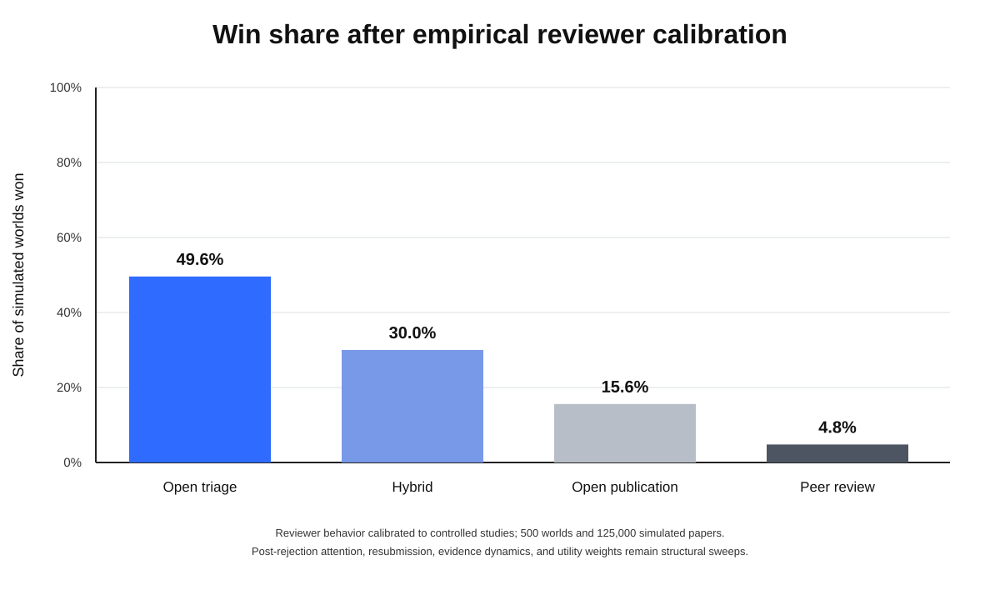
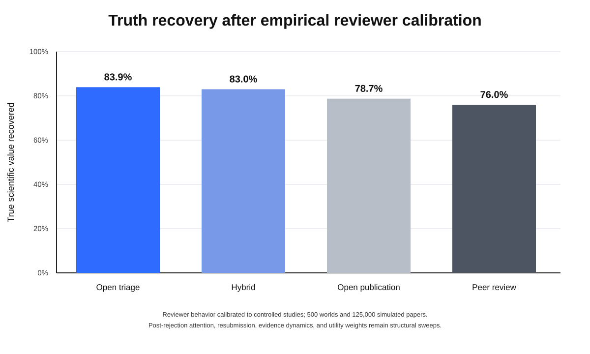

# Calibration-propagated ecosystem result

This run propagated the committed best-fitting reviewer calibration through the canonical publication ecosystem.

- Seed: `20260806`
- Worlds: `500`
- Papers per world: `250`
- Periods: `25`
- Unique papers: `125,000`
- Execution environment: Python 3.13.5, NumPy 2.3.5, pandas 2.2.3

## Results

| System | Win share | True value recovered | False recognition | Calibration MSE |
|---|---:|---:|---:|---:|
| Open triage | 49.6% | 83.94% | 0.021% | 0.0376 |
| Hybrid | 30.0% | 83.00% | 0.077% | 0.0393 |
| Open | 15.6% | 78.73% | 0.318% | 0.0487 |
| Peer review | 4.8% | 75.98% | 0.386% | 0.0552 |

Under this calibration-propagated run, peer review did not produce the highest mean truth recovery or calibration and won 4.8% of simulated worlds. Open triage won 49.6%.

## Interpretive boundary

The reviewer submodel propagates empirically calibrated error detection, disagreement, recommendation behavior, and positive-outcome bias. Post-rejection attention, resubmission, manuscript defect prevalence, evidence accumulation, and utility weights remain structural sweeps. These win shares are therefore model outcomes under partially calibrated conditions, not observed historical probabilities.
